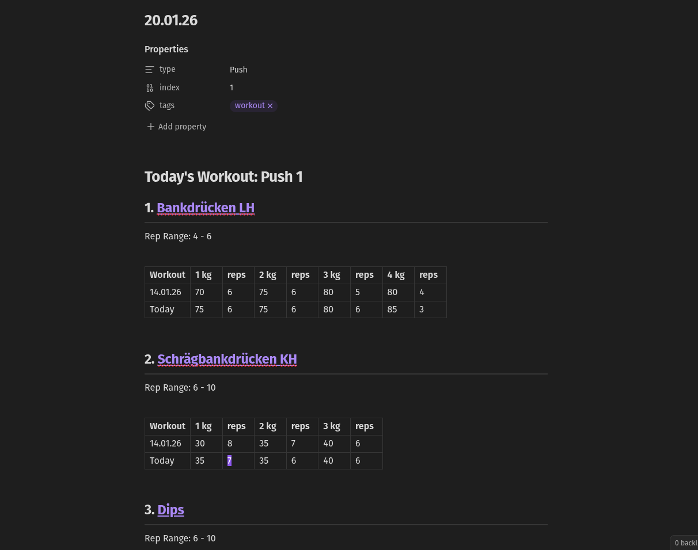

This is a product of my personal struggles to implement a good solution of tracking my gym progress within obsidian.

The solution I implemented here is using **daily notes** as a unit of workout.

Whenever you create a new daily note, the logic of the template will determine the type of workout. The logic is my workout plan, so if you don't use a binary PPL Split you are out of luck for now :D

**To be concise:**
```
Push 1 -> Pull 1 -> Legs 1 -> Push 2 -> Pull 2 -> Legs 2 -> Repeat...
```

The daily note gets filled with all **Exercises** defined in the **Workouts**:



### Workout Files 
You can edit the Workouts here:
- [[Push 1]]
- [[Pull 1]]
- [[Legs 1]]
- [[Push 2]]
- [[Pull 2]]
- [[Legs 2]]
You have to reference the exercises you define in those files correctly.

## Exercise Files
You can track your progress in the exercise files:
![[Pasted image 20260114140002.png]]

To create new exercises use the [[exercise_template]] file.
Don't forget to edit the properties (sets and reps). 

After you created the file you can add whatever information you want to the file (e.g. tutorial videos).


# Installation
You just need to get this dir to your phone. I guess you will figure out a way.

If you are on Android, termux is your friend:
```bash
git clone https://github.com/artischocki/gym-buddy
```
